# 🔴 포켓몬키우기

<p align="center">
  
  
  
  
  
  
</p>

내 바탕화면 위에서 살아 움직이는 포켓몬을 키우는 데스크톱 펫 게임입니다.
PyQt6로 만들었고, Windows용 실행 파일(exe) 하나로 바로 즐길 수 있습니다.


---

## ✨ 특징

- 바탕화면 위를 걸어 다니고, 점프하고, 드래그해서 옮길 수 있는 픽셀 애니메이션 포켓몬
- **1세대 포켓몬 19종**을 시작 포켓몬으로 선택 가능 (전체 도감은 54종까지 확장)
- **레벨업 진화**와 **진화의 돌 진화**를 정통 포켓몬스터 공식 그대로 구현
- 친밀도 · 포만감 · 목숨(하트) 시스템, 최대 6마리까지 동시 관리하는 **포켓몬 상자**
- **오박사의 PC**에 최대 50마리까지 추가 보관
- **골드 · 상점 · 인벤토리** 경제 시스템 — 열매/진화의 돌/이상한 사탕/부활의 약 구매
- 포켓몬끼리 우연히 마주치면 벌어지는 **랜덤 상호작용** (인사, 하트, 전력 질주!)
- 인터넷 연결 없이도 완전히 오프라인으로 동작
- exe를 어느 폴더에서 실행하든 세이브 데이터를 자동으로 찾는 고정 저장 경로

---

## 🎮 튜토리얼

### 1. 처음 실행하면

게임을 켜면 **새로하기 / 이어하기 / 프로그램 종료** 중 하나를 고르는 시작 화면이 뜹니다.
- **새로하기**: 시작 포켓몬을 새로 고르고 처음부터 시작합니다 (기존 데이터가 있으면 한 번 더 확인합니다).
- **이어하기**: 저장되어 있던 포켓몬을 그대로 불러옵니다. 저장 데이터가 없으면 비활성화되어 있습니다.

시작 포켓몬을 고르고 닉네임(최대 6자)을 지어주면, 그 포켓몬이 바로 바탕화면에 나타납니다.

<p align="center">
  
  
  
  
  
  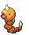
  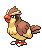
  
</p>

### 2. 포켓몬과 놀아주기

| 동작 | 효과 |
|---|---|
| 왼쪽 클릭 | 하트 이펙트 + 친밀도 소폭 상승 |
| 마우스로 드래그해서 옮기기 | 화면 아래쪽에 놓으면 친밀도 상승, 위쪽에 놓으면 하락 |
| 오른쪽 클릭 | 먹이 주기 — 인벤토리에서 지정한 기본 먹이(없으면 무료 열매)로 포만감 회복 + 친밀도 상승 |
| 가만히 두기 | 포켓몬이 알아서 걸어 다니거나, 멈추거나, 가끔 점프합니다 |

친밀도가 100이 되면 레벨이 1 올라가고 골드도 보너스로 들어옵니다.

### 3. 진화 시스템

포켓몬스터 정사 그대로, 두 가지 방식으로 진화합니다.

- **레벨업 진화**: 1회 진화하는 포켓몬은 레벨 20, 2회 진화하는 포켓몬은 레벨 15 → 30에서 자동으로 진화합니다.
- **진화의 돌 진화**: 정사에서도 돌로 진화하는 포켓몬(피카츄, 니드리나/니드리노, 삐삐, 이브이 일부)은 **상점에서 돌을 구매 → 인벤토리에서 사용**해야 진화합니다.

<p align="center">
  
  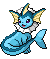
  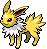
  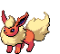
  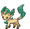
  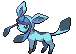
  
  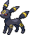
  
</p>

**이브이**는 8종의 이브이션 중 하나로 진화할 수 있는 특별한 포켓몬입니다:

| 진화체 | 진화 방법 |
|---|---|
| 샤미드 · 쥬피썬더 · 부스터 · 리피아 · 글레이시아 | 물/천둥/불/리프/얼음의 돌을 인벤토리에서 사용 |
| 에스퍼 · 블래키 · 님피아 | 정사에서도 돌이 없는 친밀도형 포켓몬 → **레벨 20 도달 시 3종 중 택1** 팝업 |

### 4. 포만감과 목숨

- 포만감은 시간이 지나면서 서서히 줄어들고, 레벨이 높을수록 조금씩 더 빨리 줄어듭니다.
- 포만감이 0이 되면 목숨(하트)이 1개 줄고, 자동으로 포켓몬 상자에 들어갑니다.
- **포만감이 0인 포켓몬은 상자에서 다시 꺼낼 수 없습니다** — 상자 안에서 우클릭으로 먼저 먹이를 줘야 해요.
- 목숨이 모두 사라지면 그 포켓몬은 상자에서 흐릿하게 표시됩니다. **부활의 약**을 사용하면 목숨을 가득 채워 되살릴 수 있습니다.

### 5. 메뉴 — 포켓볼 아이콘

화면 왼쪽 아래의 **포켓볼 아이콘**을 클릭하면 메뉴가 열립니다.

| 메뉴 | 내용 |
|---|---|
| 🎒 **포켓몬 상자** | 꺼내기/집어넣기, 이름 변경, 우클릭 먹이주기, 오박사의 PC로 보내기, 삭제. 새 포켓몬도 여기서 추가(최대 6마리) |
| 🖥️ **오박사의 PC** | 상자와 별개로 최대 50마리까지 추가 보관 |
| 🛒 **상점** | 열매(오랑/기주/기묘열매), 진화의 돌 6종, 이상한 사탕·부활의 약 구매. 수량은 −/+ 버튼이나 직접 입력으로 조절 |
| 🎒 **인벤토리** | 먹이를 우클릭하면 기본 먹이로 지정, 진화의 돌·아이템은 클릭하면 사용할 포켓몬을 고르는 창이 뜸 |

<p align="center">
  
  
  
  &nbsp;&nbsp;
  
  
  
  
  
  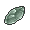
  &nbsp;&nbsp;
  
  
</p>

### 6. 포켓몬끼리의 상호작용

바탕화면에 여러 마리를 꺼내두면, 두 포켓몬이 가까이서 마주 볼 때 가끔 랜덤 이벤트가 벌어집니다:

- ❗ 서로 놀라는 리액션
- ♥ 반가워서 같이 폴짝폴짝 점프
- 💨 평소보다 4배 빠른 속도로 서로를 향해(또는 반대로) 전력 질주

---

## 📖 포켓몬 도감

### 시작 포켓몬 (19종)

| | | | |
|---|---|---|---|
|  이브이 |  피카츄 |  따라큐 |  리오르 |
|  이어롤 |  랄토스 |  꼬북이 |  이상해씨 |
|  파이리 |  캐터피 |  뿔충이 |  구구 |
|  꼬렛 | 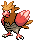 깨비참 |  아보 | 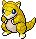 모래두지 |
|  니드런♀ | 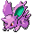 니드런♂ |  삐삐 | |

시작 포켓몬 대부분은 레벨업하면서 최종 진화체까지 이어집니다 — 예를 들어 **이상해씨 → 이상해풀 → 이상해꽃**, **파이리 → 리자드 → 리자몽**처럼요. 도감 번호 1~36번(가스톤 포함) 전체가 게임 안에 들어 있습니다.

---

## ⬇️ 다운로드 (그냥 플레이만 하고 싶다면)

Python 설치 없이 바로 실행하고 싶다면, [Releases](../../releases) 페이지에서 최신 zip 파일을 받아 압축을 풀고 `.exe` 파일을 실행하세요.

인터넷 연결이 없는 PC에서도 그대로 동작합니다. 저장 데이터는 `%APPDATA%\PokemonKiwoogi\Pokemon_saves` 폴더에 자동으로 생성되며, **exe 파일을 어느 폴더에 두고 실행하든 항상 같은 세이브를 찾습니다** — exe만 새 버전으로 교체해도 이어하기가 그대로 됩니다.

---

## 🛠️ 소스코드로 직접 실행하기

```bash
git clone https://github.com/it-mnm/pokemon-desktop-pet.git
cd pokemon-desktop-pet
pip install -r requirements.txt
python main.py
```

Windows에서는 `run.bat`을 더블클릭해도 됩니다.

직접 exe로 빌드하는 방법은 [BUILD_GUIDE_KR.md](BUILD_GUIDE_KR.md)를 참고하세요.

---

## 📁 프로젝트 구조

```
├── main.py            # 진입점, 포켓몬 상자/포켓볼 버튼, 저장 데이터 관리(PokemonManager)
├── pet.py              # 바탕화면 포켓몬 위젯 (이동/점프/진화/포만감/상호작용 로직)
├── dialogs.py           # 시작화면·상자·오박사의 PC·상점·인벤토리 등 모든 UI 다이얼로그
├── pokemon_data.py       # 포켓몬 도감/진화 규칙, 진화의 돌·아이템 데이터 테이블
├── utils.py             # 픽셀 폰트 로드, 에셋 경로, 드래그 이동, 스프라이트 크기 계산
├── save_manager.py      # JSON 저장/불러오기 + 구버전 세이브 자동 마이그레이션
├── assets/              # 포켓몬 GIF, 아이템 PNG, 픽셀 폰트, 아이콘
└── requirements.txt
```

---

## 🧩 사용 기술

- **Python 3.12**
- **PyQt6** — GUI, 애니메이션(QMovie), 프레임리스/투명 위젯
- **PyInstaller** — 단일 exe 패키징

---

## 🙏 크레딧

- 포켓몬 애니메이션 스프라이트 & 아이템 아이콘: [PokeAPI/sprites](https://github.com/PokeAPI/sprites) (Gen5 Black/White 애니메이션 스프라이트, 게임 아이템 스프라이트)
- 픽셀 폰트: `assets/fonts/dalmoori.ttf` (라이선스는 [assets/fonts/LICENSE](assets/fonts/LICENSE) 참고)

---

## ⚠️ 안내

이 프로젝트는 **비영리 팬 프로젝트**이며, 포켓몬(Pokémon)은 Nintendo, Game Freak, Creatures Inc.의 상표입니다. 상업적 목적으로 사용하지 마세요.
